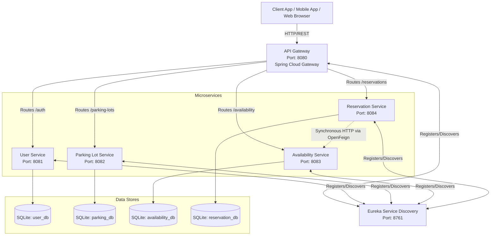

# System Architecture Document

This document defines the high-level architecture of the Smart Parking Finder platform.

## Overview

The Smart Parking Finder relies on a distributed microservices architecture implemented via the Spring Boot and Spring Cloud ecosystems. Services interact asynchronously and synchronously to form a cohesive management engine.

## Architectural Diagram

## Core Infrastructure

1.  **API Gateway (`api-gateway`)**: Serves as the single point of entry for the system. It encapsulates internal architecture and provides global policies, routing, and a unified security checkpoint via JSON Web Token (JWT) validation.
2.  **Service Registry (`discovery-server`)**: Based on Netflix Eureka. Manages the active instances for all the microservices, enabling load balancing and dynamic service resolution without hard-coded IPs or ports.
3.  **Distributed Databases**: Applying the **Database per Service** architectural pattern. Loose coupling is aggressively enforced by allocating a standalone SQLite database file per service. Microservices do not arbitrarily query each other's databases.

## Security Architecture
The platform enforces security implicitly at the boundary layer:
- **Client Action**: Upon a valid request to the User Service, a JWT token is generated.
- **Gateway Validation**: The API Gateway intercepts incoming external traffic. The standard `JwtAuthenticationFilter` inspects the HTTP `Authorization` Header. Invalid inputs are rejected (`401 Unauthorized`) immediately.
- **Claim Extraction**: The subject and role maps are transparently relayed.
