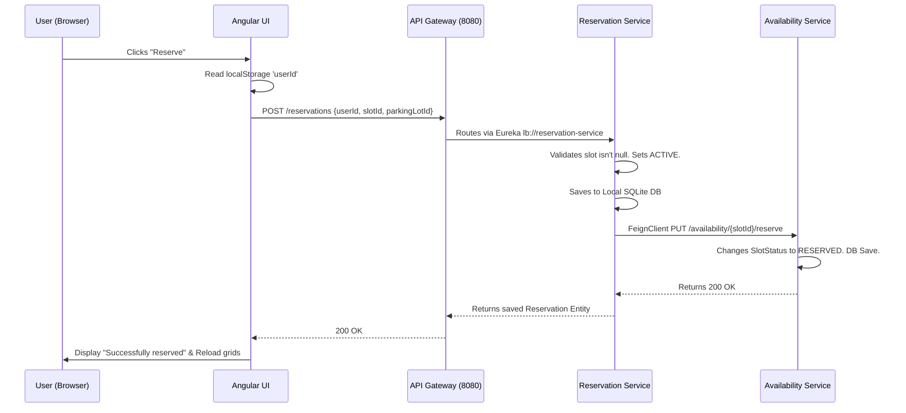

# Low-Level Design (LLD): System Sequence & Code Flow

This document explains the technical sequence of operations for the Smart Parking Finder. It breaks down exactly how the Angular UI components map to the backend Spring Boot Java services.

---

## 1. Authentication Flow

When a user logs in, the flow generates a secure JWT token that controls UI rendering and Backend access.

### Code Sequence
1. **[Angular Component] `LoginComponent.ts`** -> `onLogin()`
   - Binds to the HTML form `[(ngModel)]="username"` & `password`.
   - Calls the internal wrapper: `this.api.login({ username, password })`.
2. **[Angular Service] `api.service.ts`** -> `login(data)`
   - Executes `this.http.post('http://localhost:8080/auth/login', data)`.
3. **[Backend API Gateway]** `application.properties`
   - Intercepts `/auth/login` and routes it to `lb://user-service` (Eureka Load Balancer).
4. **[Backend Java Controller] `UserController` -> `AuthController.java`**
   - Method: `@PostMapping("/login") public ResponseEntity<AuthResponse> login(...)`
   - Calls `authService.login(...)`.
5. **[Backend Logic] `AuthService.java` & `JwtUtil.java`**
   - Verifies the database `UserRepository.findByUsername`.
   - Generates a token using HMAC SHA 256. *Critically*, the token's payload (`sub`) holds the `userId`, and the custom claim `role` holds `DRIVER` or `OWNER`.
6. **[Return to Angular] `LoginComponent.ts`** -> `subscribe({ next: (res) => ... })`
   - Token is decoded via `atob(res.token.split('.')[1])`.
   - Stores `localStorage.setItem('token', res.token)`.
   - Stores `localStorage.setItem('role', payload.role)`.
   - Stores `localStorage.setItem('userId', payload.sub)`.
   - Router automatically navigates to `/admin-dashboard` or `/user-dashboard`.

---

## 2. Dynamic Component Rendering (Owner vs Driver)

Navigation and rendering heavily rely on the `TypeScript` components evaluating the `localStorage`.

### Owner Analytics Render Flow
1. **`AdminDashboardComponent.ts`**: `ngOnInit()` validates that `localStorage.getItem('role') === 'OWNER'`.
2. Calls `loadLots()` -> `this.api.getAllParkingLots()`
3. For **each** lot returned, it triggers `loadLotAnalytics(lotId)`:
   - Fetches `/availability/{lotId}` to locally tally Free vs Reserved states using `.filter()`.
   - Fetches `/reservations/lot/{lotId}` to fetch the reservations.
   - For every active reservation, calls `this.api.getUserById(res.userId)` to recursively fetch driver names and map them to `res.userName`.

---

## 3. The Core Sequence: Making a Reservation

This is the primary flow of the application. It maps from user hardware limits down through multiple interacting Microservices via OpenFeign.

### Sequence Diagram

### Code Level Walkthrough
Below is the strict code-level mapping for reserving a slot.

#### Step 1: Angular Template triggers TypeScript
**File:** `user-dashboard.component.html`
- A button is bound to an event handler passing the current grid tile's `slot.slotId`.
- `<button (click)="reserveSlot(slot.slotId)">Reserve</button>`

#### Step 2: Component extracts local caching and executes Service
**File:** `user-dashboard.component.ts`
- The `reserveSlot(slotId)` function reads `this.currentUserId` (mapped dynamically from the JWT login stage).
- Calls the API Wrapper: `this.api.createReservation(this.currentUserId, slotId, this.selectedLotId!)` -> `.subscribe()`

#### Step 3: API Service executes the HTTP request
**File:** `api.service.ts`
- Injects standard security parameters. `this.getHeaders()` appends `Authorization: Bearer <token>`.
- Sends the `JSON` payload via `this.http.post`.

#### Step 4: Reservation Controller (Backend)
**File:** `ReservationController.java`
- Maps the incoming JSON payload into the `Reservation` object automatically via `@RequestBody`.
- Runs defensive checks: `if (reservation.getSlotId() == null) throw IllegalArgumentException;`
- Sets server-side timestamps `setStartTime(LocalDateTime.now())`.
- Saves to native database `reservationRepository.save(reservation)`.

#### Step 5: Feign Client Execution (Microservice to Microservice)
**File:** `ReservationController.java` & `AvailabilityClient.java`
- Without returning back to the UI, the Reservation logic immediately bridges to a completely different bounded context (the Availability service) using Feign! 
- `availabilityClient.reserveSlot(reservation.getSlotId());`
- This triggers a `PUT` request synchronously across the Java Docker/Spring network to the availability server.

#### Step 6: Availability Target Updates Database
**File:** `AvailabilityController.java`
- Intercepts the Feign mapping at `@PutMapping("/{slotId}/reserve")`.
- Looks up the ID in the database, grabs the entity, mutates `status.setStatus("RESERVED")`, and forces an entity save.

#### Step 7: Angular Response Callbacks
**File:** `user-dashboard.component.ts`
- The `subscribe({ next: () => ... })` block fires synchronously.
- **Critical Flow Control**: The UI immediately triggers `loadReservations()` and `checkAvailability(lotId)` dynamically.
- This creates an instantaneous DOM refresh, calculating via `getMyReservation()` that the specific Driver owns the slot, explicitly hiding the "Reserve" button and manifesting the Red "Cancel" button natively. 

---

## 4. Canceling a Reservation (Driver)

This flow reverses the reservation process, freeing up the database locks.

### Code Sequence
1. **[Angular Component] `user-dashboard.component.html`**
   - Click event triggers `cancelReservation(reservationId)`.
2. **[Angular Service] `api.service.ts`**
   - Executes `this.http.put('/reservations/{id}/cancel')`.
3. **[API Gateway]** -> Routes to `ReservationService`.
4. **[Backend Logic] `ReservationController.java`**
   - Fetches the `Reservation` from the DB by ID.
   - Updates status: `reservation.setStatus("CANCELLED")`.
   - **Cross-Service Execution**: Triggers `availabilityClient.freeSlot(reservation.getSlotId())` via Feign.
5. **[Backend Target] `AvailabilityController.java`**
   - Intercepts `@PutMapping("/{slotId}/free")` and resets the SlotStatus back to `"FREE"`.
6. **[Angular Callback]** 
   - Refresh loops execute `loadReservations()` stripping the UI of the Cancel button cleanly.

---

## 5. Geo-Proximal Parking Lot Search (Driver)

When the Driver looks for nearby grids, mathematical filtering is explicitly routed to the `parking-lot-service` directly skipping other microservices!

### Code Sequence
1. **[Angular Initialization] `user-dashboard.component.ts`**
   - `ngOnInit()` fires `navigator.geolocation.getCurrentPosition()` reading HTML5 coordinates.
2. **[UI Trigger]** -> Driver clicks "Search Nearby".
3. **[Angular Service] `api.service.ts`**
   - Sends variables out: `this.http.get('/parking-lots/nearby?lat=X&lng=Y&radiusKm=Z')`
4. **[API Gateway]** -> Routes to `ParkingLotService`.
5. **[Backend Filter] `ParkingLotController.java`**
   - Executes custom `haversine()` mathematics against the `ParkingLot` list. Filters everything outside the `{radiusKm}` boundary organically.
6. **[Return Render]** Angular sets `this.lots = res` building the visual HTML grid cards.

---

## 6. Property Management & Slot Creation (Owner)

Owners maintain the infrastructure grids dictating how many physical loops the UI builds.

### Code Sequence
1. **[Create Lot] `admin-dashboard.component.ts` -> `addLot()`**
   - Binds HTML properties (`newLot.name`, `newLot.address`) sending a `POST /parking-lots` payload.
   - `ParkingLotController` natively saves it to the SQLite configuration generating a pure `LotID`.
2. **[Create Slot] `admin-dashboard.component.ts` -> `addSlot(lotId, slotNum)`**
   - Admin binds an input (`slotNum` like 'A-1') and clicks 'Add Slot'.
3. **[Logical Binding] `ParkingLotService` -> `AvailabilityService`**
   - First, the UI fires `POST /parking-lots/lotId/slots` generating a `ParkingSlot` entity physically.
   - Upon a synchronous `next: (slot)` success, the UI **immediately** bounces a secondary query: `POST /availability`.
   - This maps the newly formed `slotId`, `lotId`, and `slotNumber` dynamically into the Availability tracker as `FREE`. Without this second sequential HTTP call, the grid would stay permanently invisible! 
